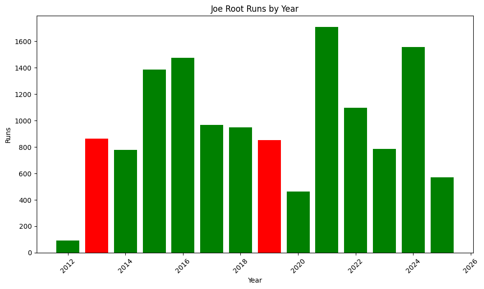

### Introduction

I am starting out with the premise that Joe Root will eventually get to 16000 test runs and along the way surpass the little master Sachin Tendulkar who amassed a whooping 15956 test runs in a career that spanned 24 years and 200 tests.

(Sachins career stats here - runs by year) - visualization

Joe root has been the finest batter England has produced by a long way, and it would be an understatement to say England has produced. He is the one of the finest bastman we have seen in world cricket. Often times we get stuck into a rut of comparing players of the same generation and also the past generation. But looking beyond the comparison of the past and the present, Root is a generational batsman. Probably one of the few batsman that will actually come close to getting to the 16000 test runs. Although the cricket fan in me says "Records are meant to be broken" and in that vein I am suggesting that Test cricket live long and we continue to see records topple in the oldest format of cricket.

Joe root currently sits on 13567 (13543) runs as I right this article after having a phenomenol Anderson-Tendulkar Trophy where he scored 430 (537) runs at an average of 67.12, and had two hundreds to his name, one at Lords.

Joe Roots career average sits at 49 (51.29) and that means if he continues playing test cricket at his current average he should get to 16000 test runs by (2433 runs required) - 25 tests (50 innings)
, 2450 runs.

So he would get it by 50 innings.

That however is an abstract number and feels like pulling out a number out of thin air without looking at the fixture England play over the course of the next year.

England have 11 test from December 2025 to December 2026.

## (Fixture list here) - Done

So, if we did a straightforward maths with current average here's when Joe root would get to 16000 test run.

Overall the last four years though, Root has had 22 hundreds and averages 56. And if he goes about scoring at the same rate then it will take about 43 innings for him to get to 16000 runs.

(Data extracted)

### (Visualization of Root runs before and after 2020) or better yet look at which point in time does Root's overall run scoring goes up.

What if though, he does not play as he played after 2020, what if he averages what he did prior to 2020?

Then it would take him 54 innings or 27 tests to get to the magical 16000 test runs.

With the Ashes coming up and another 5 tests to go, barring any unfortunate incident (protected Root in Ashes Downunder - link) we should expect Root to play each and every test. And yes, we talk about him not having a century in Australia, but he does average 40.46 against the Australians overall, and 35 (35.68) in Australia.

So given his exploit in Australia so far, lets expect him, to add 350 test runs in the Ashes.

Extract :
Here on I need the

1. fixtures of England . - Done
2. Roots year wise runs scored - DOne
3. Roots year wise runs scored vs countries - Done
4. Root's career average - DOne
5. Root's average vs country (overall) - Done
6. Root's average vs country (home and away)- depending on the fixture list - Done
7. Roots' venue wise average -

In the end though, the question is will Root hang around to break the 16000 test runs landmark. Root is 35 years old now, and in two years he will be 37 and given how fit he is, he will be around physically, but will he still have the hunger to bat. I think we should have a better picture of this in the given days to come. But right now, Root is well and truly on his way to 16000. And whether he gets there or not, he is a generational batter.

Useful Urls :
https://stats.espncricinfo.com/ci/engine/player/303669.html?class=1;template=results;type=allround
